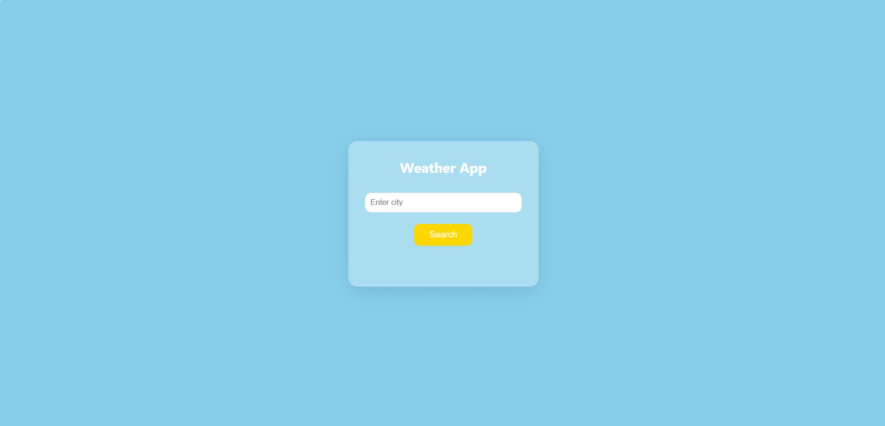
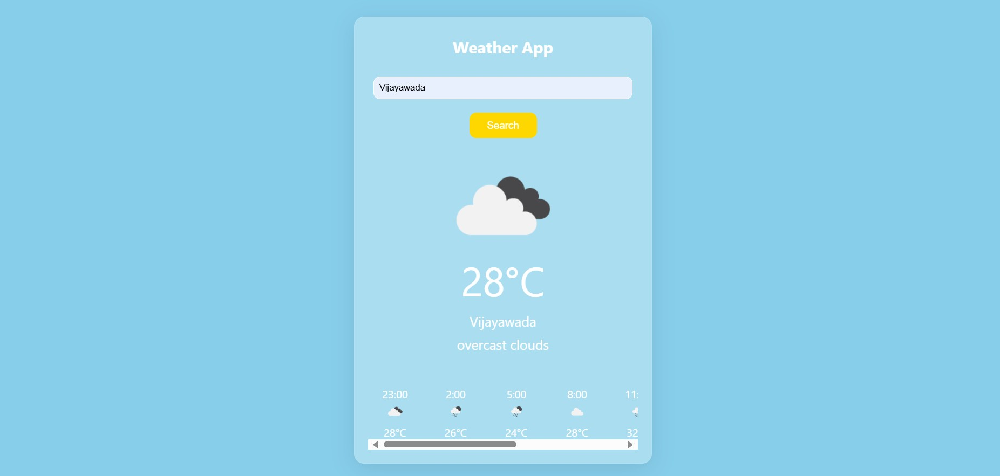

# 🌦️ Weather Forecast Web App
A **lightweight and responsive web application** that displays **real-time weather updates** and **hourly forecasts** using the **OpenWeatherMap API**.  
Built with **HTML, CSS, and JavaScript**, it provides a clean, modern interface with a sky-blue theme and smooth user experience.

## 📸 Preview

### 🏠 Home Page

### 🌤 Result Page

## 🚀 Features
- Real-time weather information for any city  
- Hourly forecast for the next 24 hours  
- City-based weather search functionality  
- Dynamic weather icons and temperature display in Celsius  
- Glassmorphism-style UI design  
- Fully responsive layout for all devices  

## 🛠️ Tech Stack
- **HTML5** – Structure of the web app  
- **CSS3** – Styling and layout design  
- **JavaScript (ES6)** – Logic and API data handling  
- **OpenWeatherMap API** – Source for live weather data  

